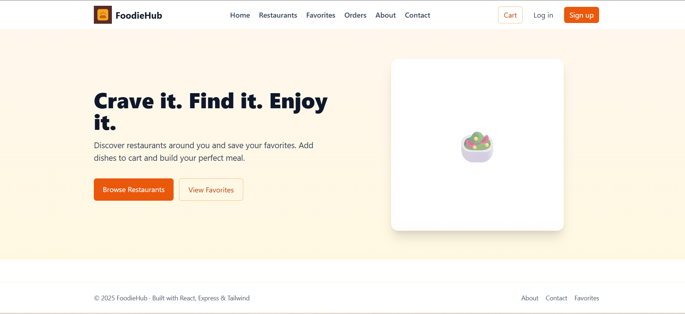

<div align="center">

# FoodieHub

Swiggy‑style food discovery app — React frontend + Express API with cached menu proxy, JWT auth, and MongoDB favorites.

<br/>

[](https://react.dev)
[](https://expressjs.com)
[](https://www.mongodb.com)
[](https://tailwindcss.com)
[](https://parceljs.org)
[](https://nodejs.org)
[](https://foodiehub-ua2d.onrender.com/)
[](./LICENSE)

<p>
  <a href="https://foodiehub-ua2d.onrender.com/" target="_blank"><b>Live Link</b> → foodiehub-ua2d.onrender.com</a>
</p>

</div>

---

## 🚀 Features

- Robust Swiggy data proxy: restaurant list + menu via backend with caching and rate limiting.
- Authentication with JWT (signup/login) and protected favorites endpoints.
- MongoDB persistence for Favorites and Recently Viewed (per-device history).
- Modern React UI with Tailwind, skeleton loaders, debounced search, and empty states.
- Configurable coordinates and API base at build time for easy deployments.

## 🧠 Architecture

High‑level overview of the system:

- Technologies: React + React Router + Redux Toolkit, Tailwind CSS, Express + Node, MongoDB, Axios, Helmet, express‑rate‑limit, NodeCache, Parcel bundler.
- Interaction: The frontend calls a small Express backend that proxies Swiggy endpoints, adds caching and CORS handling, and stores user data in MongoDB.
- Persistence: MongoDB collections store `users`, `favorites`, and `recentlyViewed` items.
- Security: JWT for protected routes, Helmet for headers, CORS control, and basic rate limiting.

```
┌────────────────────────────────────┐        ┌──────────────────────┐
│            React Frontend          │        │      MongoDB         │
│  (Parcel build, Tailwind UI)       │        │  users/favorites/RV  │
└───────────────┬────────────────────┘        └──────────┬───────────┘
                │  HTTPS (API_BASE_URL)                   │
                ▼                                         │
        ┌───────────────────────────┐                      │
        │        Express API        │◄──── JWT ───────────┘
        │  helmet, cors, rate-limit │
        │  cache(proxy→Swiggy)      │
        └──────────┬────────────────┘
                   │
                   ▼
             Swiggy public API
```

## 🛠️ Tech Stack

- Frontend: `react`, `react-router-dom`, `react-redux`/`@reduxjs/toolkit`, `tailwindcss`, `parcel`
- Backend: `express`, `axios`, `helmet`, `compression`, `cors`, `express-rate-limit`, `jsonwebtoken`, `mongoose`, `node-cache`, `morgan`, `bcryptjs`
- Language/Runtime: `node >= 18`
- Infra/Deploy: Render (see `render.yaml`), static frontend in `dist/`

## 📦 Installation

Prerequisites: Node 18+, a MongoDB connection string (local or Atlas).

1. Backend

```powershell
cd backend
npm install
# create .env and set variables (see Configuration)
npm run dev
# Health check
Invoke-WebRequest http://localhost:8080/health | Select-Object -ExpandProperty Content
```

2. Frontend

```powershell
cd ..   # project root
npm install
# Start dev server (Parcel)
npm start

# Optionally run with your local backend in dev
$env:API_BASE_URL="http://localhost:8080"; npm start
```

## 🧪 Running the Project

- Development

  - Backend: `cd backend; npm run dev`
  - Frontend: at repo root `npm start`

- Production
  - Build frontend with your API base URL:
    ```powershell
    $env:API_BASE_URL="https://YOUR-BACKEND.onrender.com"; npm run build
    ```
  - Serve the static `dist/` directory (any static host). Backend runs with `cd backend; npm start`.

> Docker: No Dockerfile in repo. If you want one, open an issue and we can add it.

## 🔍 Usage

- Browse restaurants on the home page; search is debounced for responsiveness.
- Click a restaurant to view its menu (fetched via backend proxy).
- Sign up and log in to add/remove favorites (protected via JWT).
- Recently Viewed is tracked per device using a deviceId stored in `localStorage`.

Screenshots:

<p align="center">
  
  
  
  
</p>

## ⚙️ Configuration

Backend (`backend/.env`):

```env
PORT=8080                    # Render supplies this automatically
NODE_ENV=development         # or production
ALLOWED_ORIGIN=*             # or https://your-frontend.example
MONGODB_URI=YOUR_MONGODB_URI # required for persistence
MONGODB_DB=foodiehub         # optional database name
JWT_SECRET=please-change     # required in production
JWT_EXPIRES_IN=7d            # token expiry
CACHE_TTL=300                # seconds; cache for proxy endpoints
SWIGGY_DEFAULT_LAT=          # optional default coordinates
SWIGGY_DEFAULT_LNG=
```

Frontend (build‑time env at repo root):

```powershell
$env:API_BASE_URL="http://localhost:8080"; npm start   # dev
$env:API_BASE_URL="https://YOUR-BACKEND.onrender.com"; npm run build   # prod
```

## 🧵 API Endpoints

Base URL is your backend (local `http://localhost:8080`).

- `GET /health` → `{ ok: true, uptime }`
- Auth
  - `POST /api/auth/signup` → `{ ok, token, user }`
  - `POST /api/auth/login` → `{ ok, token, user }`
  - `GET /api/auth/me` (Bearer token) → `{ ok, user }`
- Swiggy proxy
  - `GET /api/restaurants?lat=..&lng=..` → restaurant list JSON
  - `GET /api/restaurants/:id?lat=..&lng=..` → menu JSON
- Favorites (Bearer token)
  - `GET /api/favorites` → `{ ok, items }`
  - `POST /api/favorites` `{ restaurantId, info? }` → `{ ok, item }`
  - `DELETE /api/favorites/:restaurantId` → `{ ok: true }`
- Recently Viewed (device-scoped)
  - `GET /api/recently-viewed?deviceId=...&limit=20`
  - `POST /api/recently-viewed` `{ deviceId, restaurantId, info? }`

## 📈 Performance / Benchmarks

- Proxy responses are cached in‑memory using `node-cache` with `CACHE_TTL` (default 300s).
- `express-rate-limit` caps clients at 120 req/min per IP to protect upstream.

## 🧩 Folder Structure

```
.
├─ backend/
│  ├─ src/
│  │  ├─ lib/           # config, cache, auth, db connection
│  │  ├─ models/        # mongoose models (User, Favorite, RecentlyViewed)
│  │  └─ routes/        # auth, favorites, recentlyViewed, swiggy, health
│  └─ package.json
├─ src/                 # React app (components, utils, store)
├─ render.yaml          # Render deploy config
├─ index.html, index.css
├─ package.json         # frontend build (Parcel) & root scripts
└─ docs/                # screenshots used in this README
```

## 🛡️ Security

- `JWT` auth for protected routes (favorites).
- `helmet` for secure HTTP headers.
- `cors` with configurable `ALLOWED_ORIGIN`.
- `express-rate-limit` to mitigate abuse of proxy endpoints.
- Passwords hashed with `bcryptjs`.

## 📦 Deployment

Render (recommended)

- Backend (Web Service)

  - Root: `backend/`
  - Build: `npm install`
  - Start: `npm start`
  - Env: `MONGODB_URI`, `ALLOWED_ORIGIN`, `JWT_SECRET`, `CACHE_TTL` (optional). `PORT` provided by Render.

- Frontend (Static Site)
  - Root: repo root
  - Build: set API and build with Parcel
    ```powershell
    $env:API_BASE_URL="https://YOUR-BACKEND.onrender.com"; npm run build
    ```
  - Publish directory: `dist/`

Live link: https://foodiehub-ua2d.onrender.com/

## 🧠 Future Improvements

- Replace in‑memory cache with Redis for multi‑instance deployments.
- Add e2e tests and CI pipeline.
- Improve accessibility and add keyboard navigation.
- Add pagination and sorting for lists.
- Add user profile and social sign‑in (OAuth).
- Add orders/cart backend and payment integration (demo mode).
- Add Docker files for local/dev parity.

## 📝 License

ISC — see [LICENSE](./LICENSE).

## 🙌 Acknowledgements

- Inspired by Swiggy’s public web API structure.
- Logos and badges courtesy of Shields.io and respective projects.
